# sac-workshop-2014

Computational design workshop @ [Städelschule Frankfurt](http://www.staedelschule.de/architecture/), Dec 2014

# About

This workshop was run with Year 2 students of the architecture class @
SAC and served both as intensive treatment/introduction of general
intermediate level programming techniques and computational methods
for topics related to architectural design practice. The examples in this
repository were all developed from scratch as group during the
workshop, but heavily rely on functionality provided by toxiclibs (and
of course Processing).

# Requirements

- [SourceTree](http://sourcetreeapp.com/)
- [Source code for this repo](https://github.com/learn-postspectacular/sac-workshop-2014)

**Note:** We used a build of the current
[master branch](http://hg.postspectacular.com/toxiclibs/src) of the
toxiclibs repo. Some examples *might not* work with earlier versions
(i.e. the last official release v0020).

## Day 1 - Iterative processes

- Iterative processes / feedback functions
- Discussion of various looping constructs
- Discrete time vs. real time
- Basic RGB color theory
- Pixel manipulations
- Cross-domain parameter mapping

[Source code](day1/)

### Strange Attractors (DeJong)

| DeJong1 | DeJong2 |
| ------- | ------- |
| 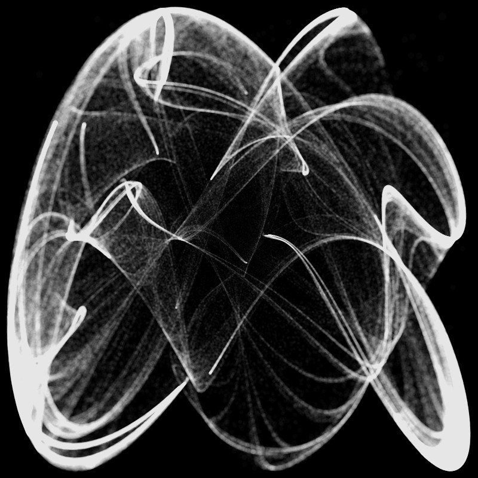 | 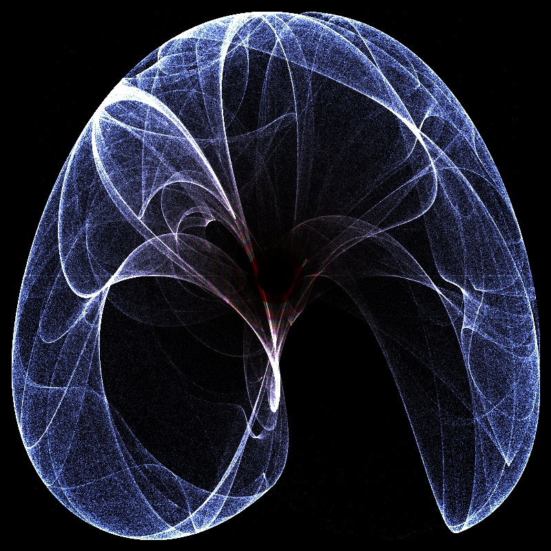 |

### References

- https://en.wikipedia.org/wiki/Attractor
- http://paulbourke.net/fractals/peterdejong/

## Day 2

- 2D/3D vector algebra / geometry / geometry data types
- Introduction to OOP
- Introduction to toxiclibs verlet physics
- Clustering
- Probabilistic choice selection
- Mesh structures
- Mesh export

[Source code](day2/)

### City clusters

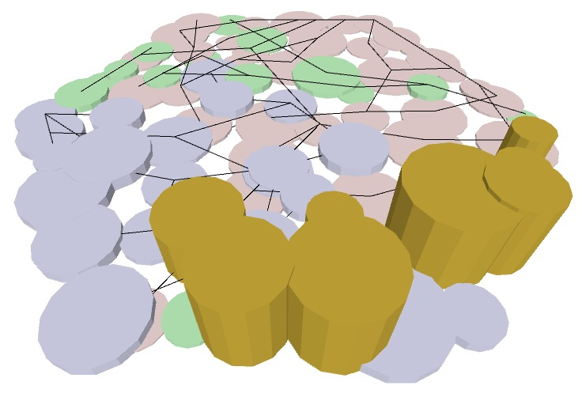

## Day 3

- Introduction to agents
- Mesh generation/conversion from 2D/3D entities
- In-depth discussion of mesh structures
- Mesh subdivision strategies
- Recursion
- Rendering

[Source code](day3/)

### Di-pole fieldline agents

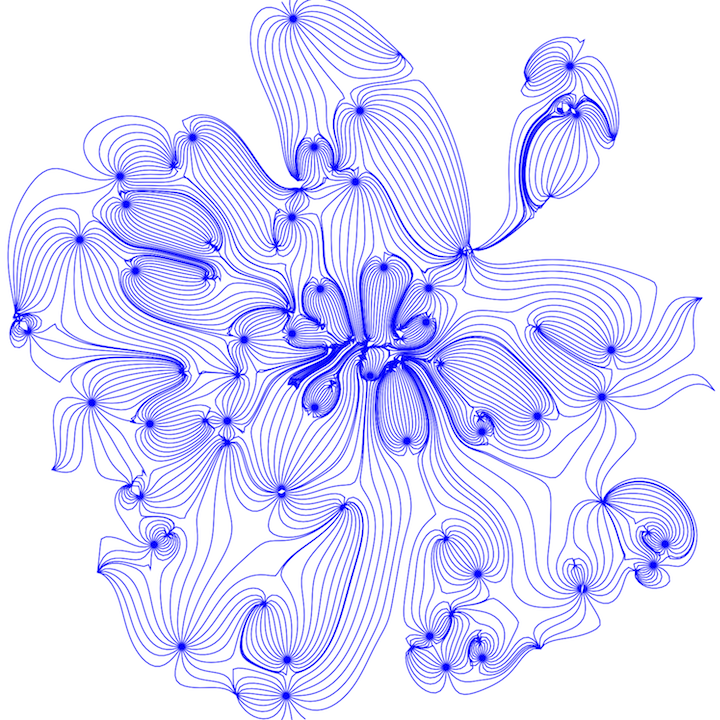

### Sequential / recursive subdivisions

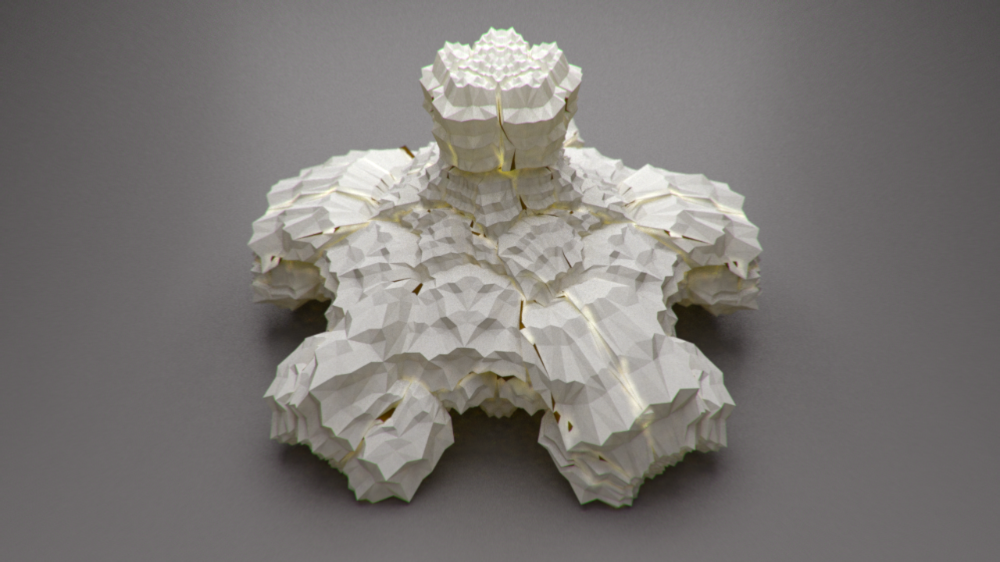

## Day 4

- Mesh construction using point strands/lists
- Recursive application of Parallel-transport frames (sweep meshes)
- Define 2D subdivision schemes
- In-depth discussion of normal vectors
- 3D mesh export from 2D line strips
- More complex hybrid-2D/3D agent system based on contour finding
- Systematic exploration of parametric design/search spaces

[Source code](day4/)

### From points to curves to meshes

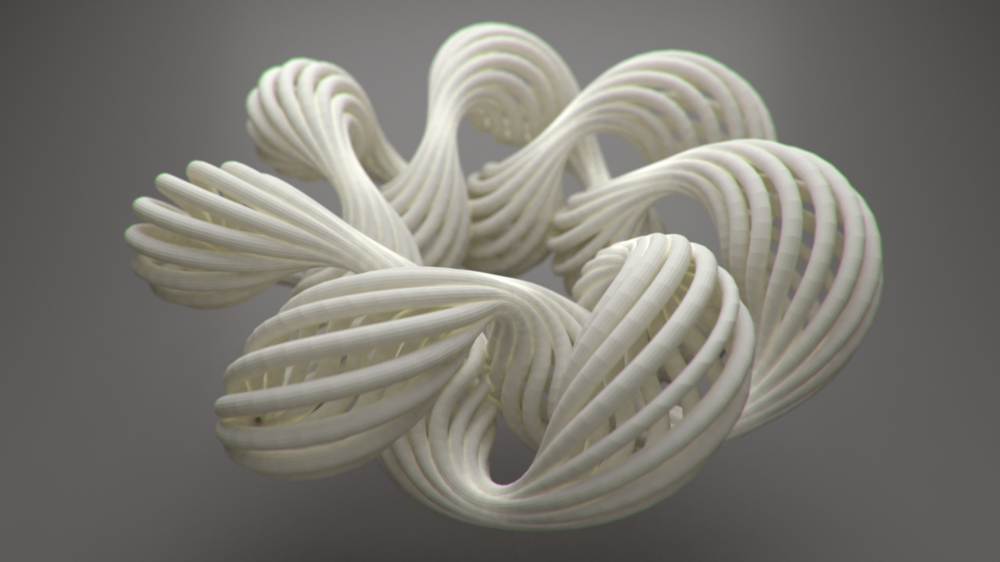

### 2D Subdivions

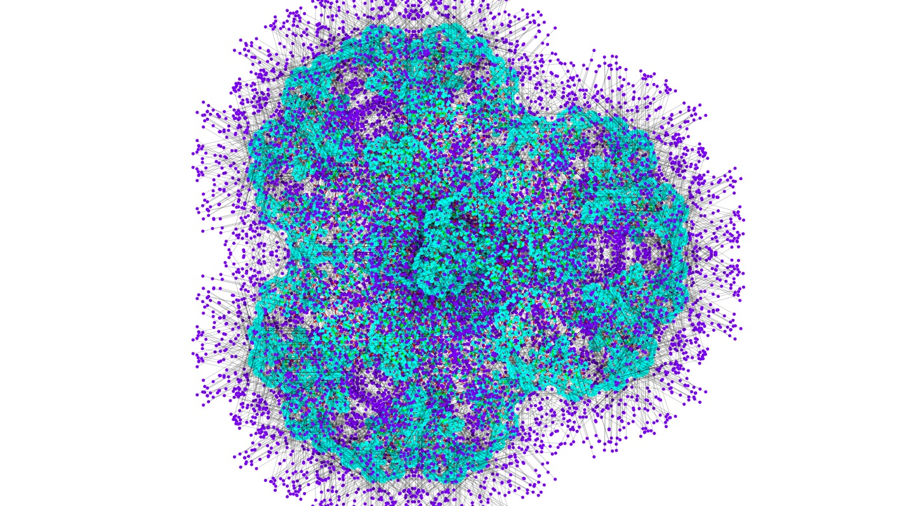

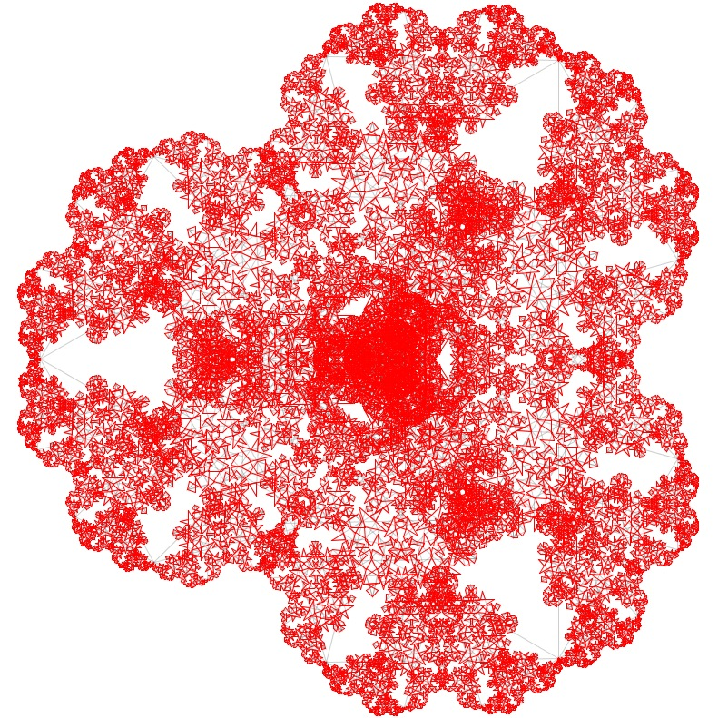

### Terrain Agents

| scan dist | speed 0.5 - 2 | speed 1 - 3 | speed 1 - 4 | speed 2 - 5 |
| --------- | ------------- | ----------- | ----------- | ----------- |
| 10        | 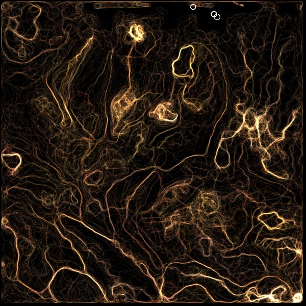 |  | 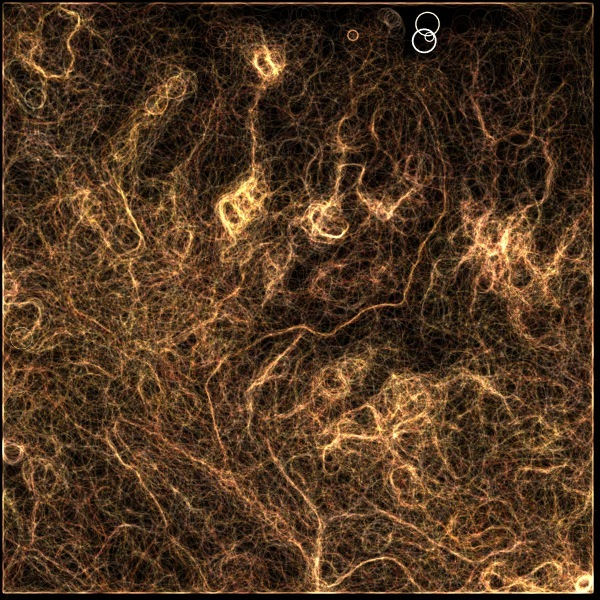 |  |
| 20        | 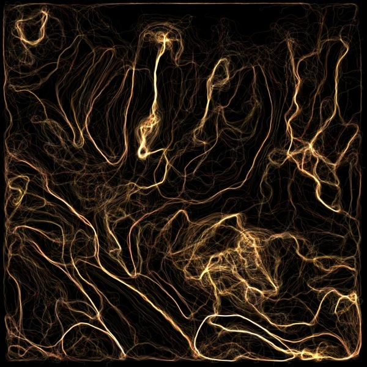 | 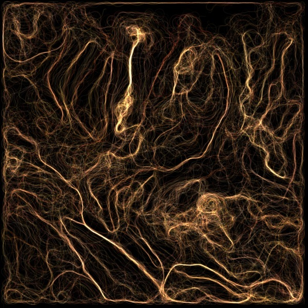 |  | 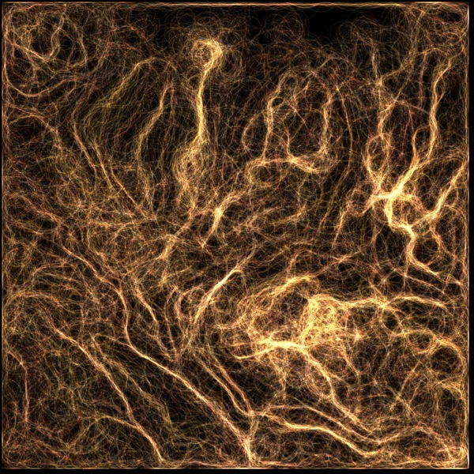 |
| 40        | 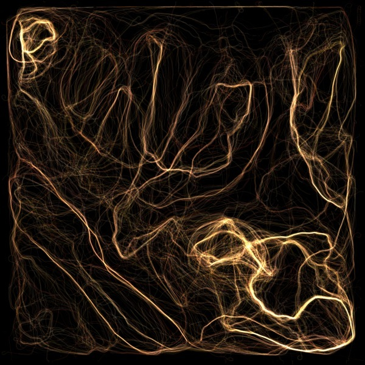 | 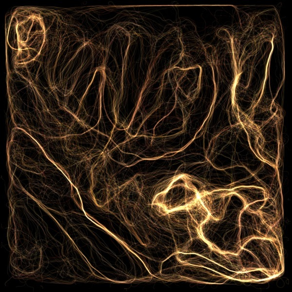 | 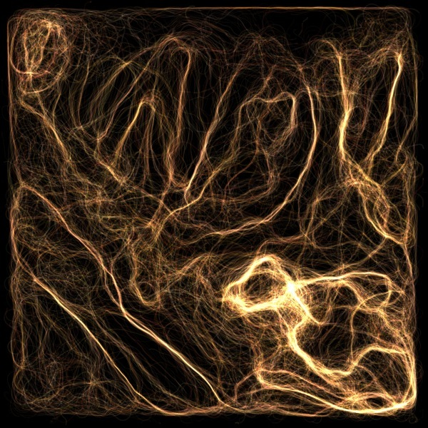 | 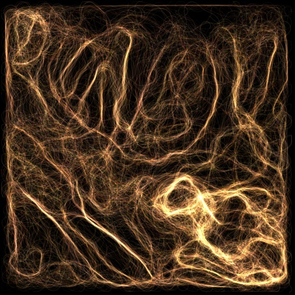 |

## Day 5

- Working with external data sets
- CSV parsing
- Data structures: HashMaps, Sets
- Aggration functions
- Data analysis: finding/defining connections/relations
- Data visualization (chord graph)

[Source code](day5/)

### Chord graph visualization

## License

With exception of the [PTFTest](day4/PTFTest/) example, all other examples are published under the
[LGPLv3 license](http://www.gnu.org/licenses/lgpl-3.0.txt). A copy of
the license text is also supplied within the repository.

[PTFTest](day4/PTFTest/) demo licensed under [Apache Software License 2.0](http://www.apache.org/licenses/LICENSE-2.0).

All non-code assets are published under the [Creative Commons Attribution-NonCommercial license](http://creativecommons.org/licenses/by-nc/4.0).

&copy; 2014 Karsten Schmidt
