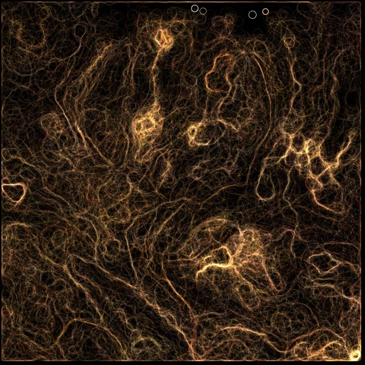
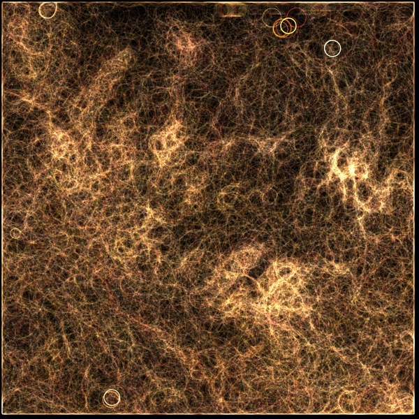

# sac-workshop-2014

Computational design workshop @ [Städelschule Frankfurt](http://www.staedelschule.de/architecture/), Dec 2014

# Requirements

- [Processing](http://processing.org)
- [toxiclibs](http://toxiclibs.org)
- [SourceTree](http://sourcetreeapp.com/)
- [Source code for this repo](https://github.com/learn-postspectacular/sac-workshop-2014)

## Day 1 - Iterative processes

- https://en.wikipedia.org/wiki/Attractor
- http://paulbourke.net/fractals/peterdejong/

- [Source code](day1/)

## Day 2

TBD

## Day 3

TBD

## Day 4

### Agents

| scan dist | speed 0.5 - 2 | speed 1 - 3 | speed 1 - 4 | speed 2 - 5 |
| --------- | ------------- | ----------- | ----------- | ----------- |
| 10        |  |  |  |  |
| 20        |  |  |  |  |
| 40        |  |  |  |  |

## Day 5

TBD

http://pastebin.com/aBi8Vb9x
